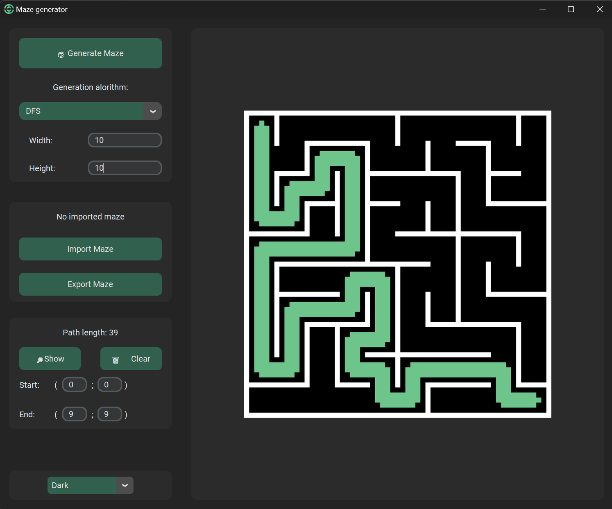
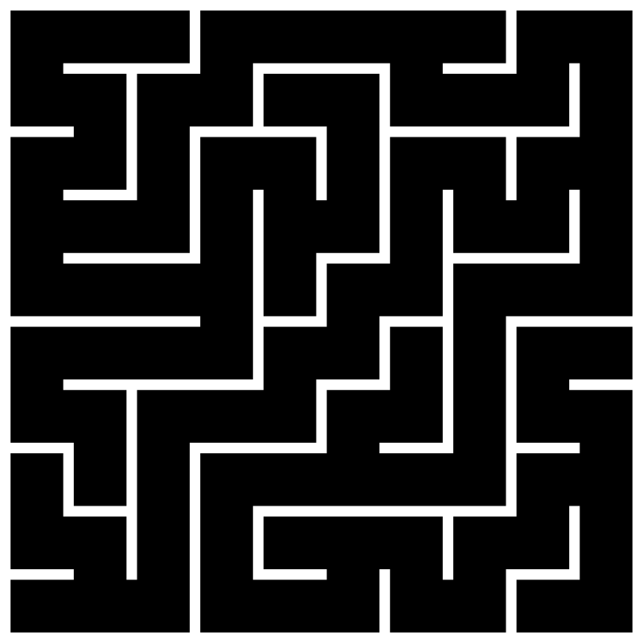
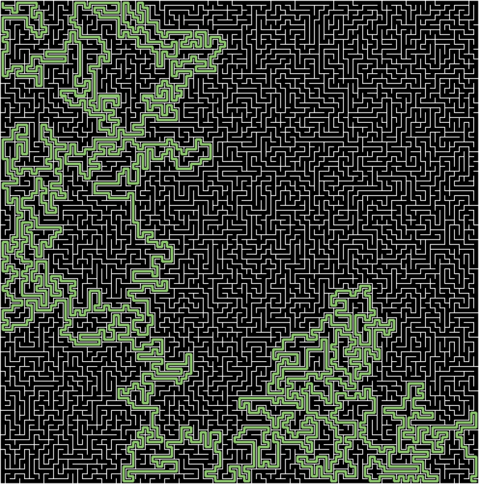

# Генератор лабиринтов

Генератор лабиринтов позволяет создавать случайные лабиринты любого размеры, экспортировать и имппортировать уже сгенирированные и находить наикратчайший путь между двумя точками в лабиринте.

## 🧩Примеры лабиринтов

## 📖Использование

### Генерация лабиринта🎲

**Кнопка Generate Maze**
Генеририрует новый лабиринт с заданными параметрами.

**Generation Algorithm**
Выбор алгоритма генерации лабиринта. На данные момент есть только 3 алгоритма - алгоритмы, основанные на `DFS`, `BFS` и `Kraskal` из теории графов.

**Width, Height**
Поля, задающие ширину и высоту поля соответственно (в количестве клеток по ширине и высоте).

### Поиск пути🔎

**Кнопка Show**
Показывает наикратчайший (и единственный) путь между двумя точками с заданными координатами.

**Кнопка Clear**
Скрывает построенный путь.

**Поля ввода Start/Finish**
Координаты начала и конца пути для построенния в формате `(x; y)`, где `(0; 0)` находится в левом верхнем углу и координаты нумеруются слева-направо сверху-вниз.

### Импорт/Экспорт💾

**Кнопка Import Maze**
Открывает окно для выбора файла лабиринта. Считывает только файлы с расширением `.maze`. Из этих файлов задаётся лабиринт, его размер и алгоритм, используемые при его генерации. Если считывается некорректные файл, то появляется окно с ошибкой.

**Кнопка Export Maze**
Открывает окно для выбора директории экспорта лабиринта. Можно экспортировать в двух форматах:
*Maze (`.maze`)* - данный файл потом можно заново открыть в программе. Сохранится сам лабиринт, его размер и алгоритм генерации.
*PNG Image (`.png`)* - лабиринт экспортируется в формате png картинки. Если в этот момент на лабиринте построен какой-то путь, то в картинке сохранится лабиринт с этим путём.

### Смена темы🌓

**Выбор темы**
Есть 2 темы тёмная (Dark) и светлая (Light). Цвета не просто инвертируется, а именно различаются в разных темах, сохраняя зелёный🟢, как основной акцентный цвет.

## ⚙️Принцип работы

### Генераторы🎲

* **Алгоритм DFS**
  Основан на алгоритме поиска в глубину. Начинает обход из случайной клетки лабиринта, выбирает соседа и идёт в него, не заходя в клетки, в которых уже был. Так продолжается до тех пор, пока не будет обойдён весь лабиринт. При этом, если в какой-то момент обхода не остаётся соседей, то возвращается назад до тех пор, пока это можно будет сделать и продолжаем обход.
* **Алгоритм BFS**
  Основан на алгоритме поиска в ширину. Начинает обход из случайной клетки лабиринта, записывает всех соседей в очередь и идёт в случайного из них. Потом выбираем случайную клетку из нашей очереди, строим из неё случайный путь в наш лабиринт и записываем всех соседей этой клетки в очередь. Так продолжается до тех пор, пока не будет обойдён весь лабиринт.
* **Алгоритм Краскала**
  Основан на алгоритме поиска минимального остовного дерева алгоритмом Краскала. Храним все группы вершин лабиринта в массиве. Начинаем с того, что каждая вершина лабиринта - отдельная группа. Затем выбираем случайную группу, потом выбираем вторую случайную группу, соседнюю первую и объединяем эти 2 группы. Так продолжаем до тех пор, пока не останется только одна группа - весь лабиринт.

### Архиватор🗄️

На самом деле архиватор сохраняет только 4 числа в бинарный файл:

| Название | Комментарии                                                    | Размер   |
| ---------------- | ------------------------------------------------------------------------- | -------------- |
| Ширина     | Ширина лабиринта, который мы сохраняем   | 2 байта   |
| Высота     | Высота лабиринта, который мы сохраняем   | 2 байта   |
| Сид           | Сид рандома, используемый при генерации | 8 байтов |
| Алгоритм | Номер алгоритма для генерации                   | 1 байт     |

То есть, нам не нужно сохранять весь лабиринт для его восстановления. Достаточно сохранить информацию о его генерации и сгенерировать его заново с этой информацией. В результате лабиринт любого размера можно уместить в файле размером **всего 15 байтов**.
